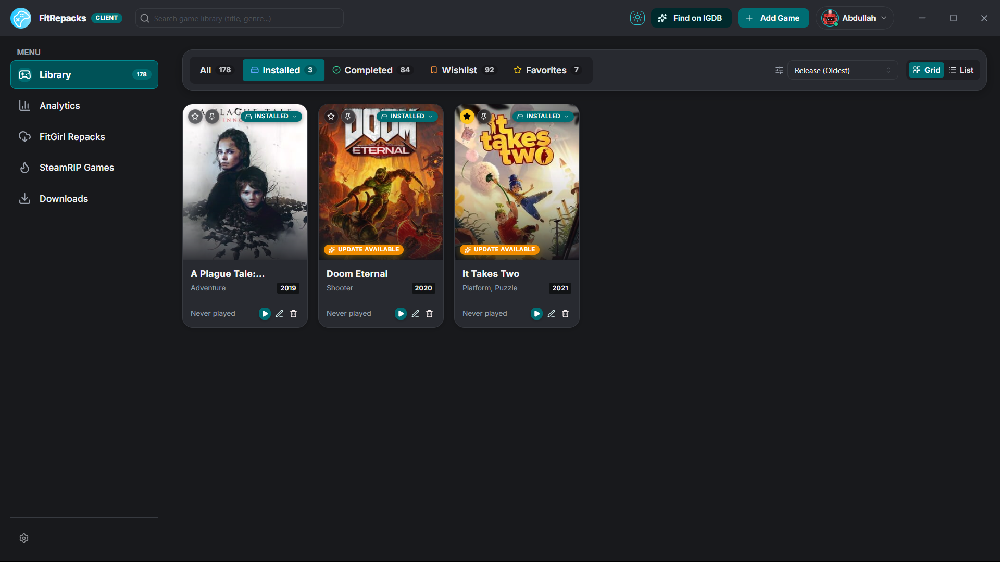
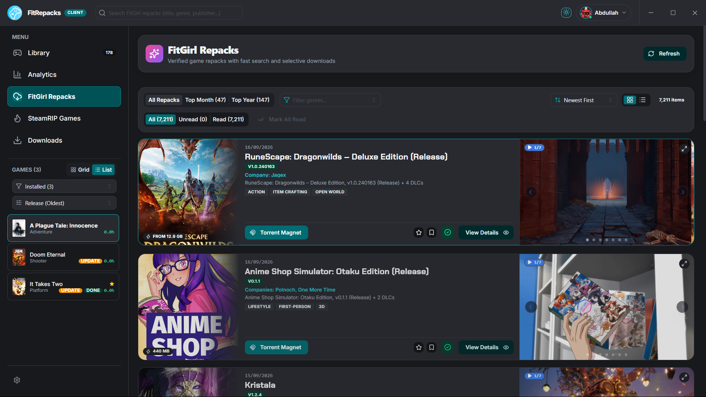
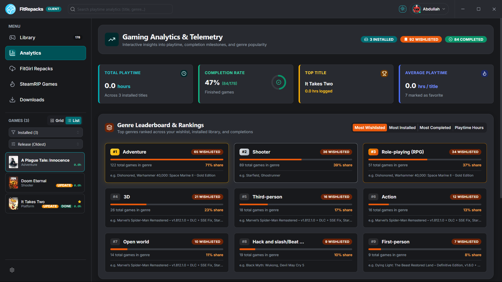

# FitRepacks Library

A lightweight, open-source desktop library manager and launcher for PC games and repacks. Built with Tauri v2, Next.js, and Mantine, it gives you a fast and minimal interface to organize your local games, track playtime, browse release catalogs, and fetch rich metadata from IGDB and Steam.



## Overview

FitRepacks Library brings your local game installs and release catalogs together under one dashboard. It stores your library locally using SQLite, runs with a minimal memory footprint via Rust, and offers optional sync through AlsaBase.

## Screenshots

### Game Catalog & Repack Releases

Browse repack catalogs with search, genre filters, magnet links, and direct downloads.



### Playtime Analytics & Telemetry

Track total hours, completion status, favorite titles, and genre breakdowns over time.



## Core Features

- Local Library Management: Add installed games manually or scan directories. Supports custom executable paths, working directories, launch parameters, and uninstaller detection.
- Catalog Browsing: Search and filter thousands of repack releases (FitGirl, SteamRIP) with instant magnet/torrent links and mirrors.
- Metadata & Media Fetching: Pull official game summaries, genres, cover art, release dates, and screenshots using IGDB and Steam APIs.
- Playtime Tracking: Automatic session timing and stats tracking for every game launched through the client.
- Built-in Download Tracking: Monitor downloads and torrent tasks directly within the app.
- System Tray Integration: Background minimizes to tray with quick-launch shortcuts and active download summaries.
- Local-First Architecture: All data is saved to a local SQLite database by default. Optional AlsaBase integration allows cross-device synchronization.

## Tech Stack

- Backend: Tauri v2, Rust (SQLite plugin, system tray, single instance, process management)
- Frontend: Next.js 16 (Static Export), React 19, TypeScript
- UI & Styling: Mantine v9, PostCSS, Lucide Icons, Embla Carousel
- State Management: Zustand
- Linting: Oxlint

## Prerequisites

Before building or running the project, make sure you have:

- Node.js 20 or newer
- Rust toolchain (stable channel via `rustup`)
- Build prerequisites for your OS:
  - Windows: Microsoft C++ Build Tools (via Visual Studio Installer)
  - Linux: Tauri dependencies (`libwebkit2gtk-4.1-dev`, `build-essential`, `curl`, `wget`, `libssl-dev`, `libgtk-3-dev`, `libayatana-appindicator3-dev`, `librsvg2-dev`)
  - macOS: Xcode Command Line Tools

## Getting Started

### 1. Clone the repository

```bash
git clone https://github.com/alsasoft-web/fitrepacks-library.git
cd fitrepacks-library
```

### 2. Install dependencies

```bash
npm install
```

### 3. Set up environment variables

Copy the example configuration file:

```bash
cp .env.example .env
```

Edit `.env` with your API credentials:

```env
NEXT_PUBLIC_IGDB_CLIENT_ID=your_twitch_client_id
NEXT_PUBLIC_IGDB_CLIENT_SECRET=your_twitch_client_secret
NEXT_PUBLIC_STEAM_API_KEY=your_steam_web_api_key
NEXT_PUBLIC_ALSABASE_URL=https://your-alsabase-instance.com
```

Notes on API keys:

- IGDB: Register an application on the Twitch Developer Console to obtain a Client ID and Client Secret.
- Steam API: Obtain an API key from the Steam Community Developer portal.
- AlsaBase: Optional. Leave empty if you only want local SQLite storage.

### 4. Run the development server

Start the Next.js frontend and Tauri application concurrently:

```bash
npm run tauri:dev
```

To run only the web frontend in a browser for rapid UI iteration:

```bash
npm run dev
```

## Build & Release

To compile the application and produce a standalone desktop installer:

```bash
npm run tauri:build
```

The compiled binaries and installers will be generated under `src-tauri/target/release/bundle/`.

## Available Scripts

| Command               | Description                                                  |
| --------------------- | ------------------------------------------------------------ |
| `npm run tauri:dev`   | Start Tauri desktop app in development mode with live reload |
| `npm run tauri:build` | Build optimized static frontend and native installer         |
| `npm run dev`         | Run Next.js frontend dev server on `http://localhost:3000`   |
| `npm run build`       | Build static Next.js export (`out/`)                         |
| `npm run lint`        | Run Oxlint fast linter across the project                    |

## Project Structure

```text
FitRepacks Library/
├── app/                  # Next.js App Router entry and main view
├── assets/               # Screenshots and documentation media
├── components/           # UI components
│   ├── analytics/        # Playtime and telemetry charts
│   ├── auth/             # AlsaBase authentication views
│   ├── common/           # Shared buttons, modals, and inputs
│   ├── layout/           # App navigation and custom window titlebar
│   ├── library/          # Game cards, grid views, and edit dialogs
│   └── repacks/          # Repack catalog tables, search, and filters
├── lib/                  # State stores, SQLite handlers, IGDB/Steam services
├── public/               # Static web assets
├── scripts/              # Catalog scraping utilities and build helpers
├── src-tauri/            # Rust native backend and Tauri configuration
│   ├── capabilities/     # Tauri v2 security permissions
│   ├── icons/            # App icons for Windows, macOS, Linux
│   ├── src/main.rs       # Window management, tray, and process runner
│   └── tauri.conf.json   # Tauri application manifest
├── theme.ts              # Mantine dark theme configuration
└── package.json          # Dependencies and npm scripts
```

## Contributing

Contributions, bug reports, and suggestions are welcome. Please check [CONTRIBUTING.md](CONTRIBUTING.md) for details on code style, branch guidelines, and submitting pull requests.

## Disclaimer

FitRepacks Library is a catalog aggregator, library manager, and launcher utility created for personal organization and educational purposes. It does not host, upload, or distribute game binaries directly. Users are responsible for complying with all applicable laws and intellectual property regulations in their jurisdiction.

## License

Distributed under the MIT License. See [LICENSE](LICENSE) for more information.
